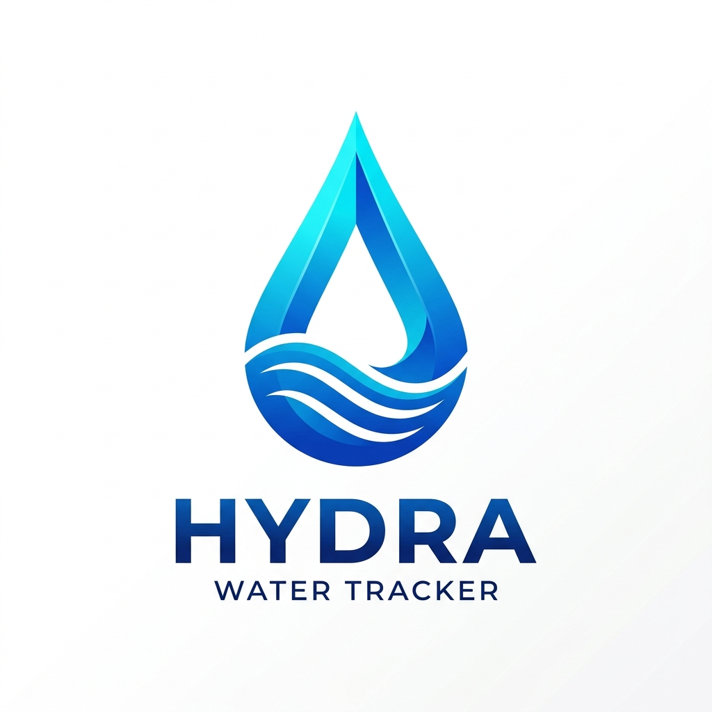

# 
 Hydra - Water Tracker

  <em>A premium, privacy-focused hydration tracking suite for everyone.</em>

---

Hydra is a beautifully designed, cross-platform hydration tracking application. Built with a focus on aesthetics and performance, Hydra helps you stay on top of your daily water intake with real-time feedback, detailed analytics, and seamless multi-device synchronization.

## ✨ Key Features

- **🌊 Fluid Visual Progress:** A dynamic, animated hydration ring that reflects your current intake status.
- **📱 Mobile & Desktop Ready:** Optimized experiences for both handheld and large-screen devices.
- **📊 Detailed Analytics:** Track your hydration trends over time with built-in history and daily summaries.
- **🔥 Streaks & Goals:** Stay motivated with daily streaks and easily adjustable hydration targets.
- **☁️ Real-time Sync:** Powered by Firebase for instant data synchronization across all your devices.
- **🌓 Dark Mode:** Seamless support for system-level light and dark themes.
- **✨ Premium UI:** Built with Vanilla CSS, featuring glassmorphism, micro-animations, and smooth transitions.

## 🚀 Getting Started

Hydra is designed to be lightweight and easy to deploy.

1. **Local Access:** Simply open `index.html` (Landing Page) or `hydra.html` (App) in any modern web browser.
2. **Configuration:** Update `firebase-config.js` with your own Firebase credentials to enable cloud sync.
3. **Deployment:** Optimized for Firebase Hosting, GitHub Pages, or any static hosting service.

## 🛠️ Technology Stack

- **Frontend:** Semantic HTML5, Vanilla CSS3, Modern JavaScript (ES6+).
- **Backend:** Firebase Firestore (Real-time Database).
- **Deployment:** Firebase Hosting.
- **Design:** Modern typography (Inter), Glassmorphism, CSS Animations.

---

Made with ❤️ for a healthier world.
